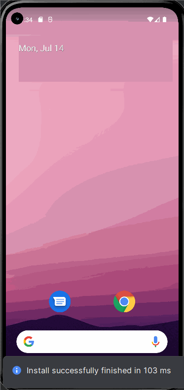

<!-- (This is a comment) INSTRUCTIONS: Go through this page and fill out any **bolded** entries with their correct values.-->

# AND101 Project 5 - Choose Your Own API

Submitted by: **Elite Weather App**

Time spent: **8** hours spent in total

## Summary

**Elite Weather App** is an android app that **provides real-time weather updates, a 3-day forecast, and air quality information (https://www.weatherapi.com/api.aspx) with a modern and intuitive user interface.**

If I had to describe this project in three (3) emojis, they would be: **🌞☔❄️**

## Application Features

<!-- (This is a comment) Please be sure to change the [ ] to [x] for any features you completed.  If a feature is not checked [x], you might miss the points for that item! -->

The following REQUIRED features are completed:

- [x] Make an API call to an API of your choice using AsyncHTTPClient
- [x] Display at least three (3) pieces of data for each API entry retrieved
- [x] A working Button requests a new API entry and updates the data displayed

The following STRETCH features are implemented:

- [x] Add a query to the API request
    - The query I added is **Seach for another location**
- [x] Build a UI to allow users to add that query

The following EXTRA features are implemented:

- [x] List anything else that you added to improve the app!

- Smart Location Search
    Instantly get weather updates by typing any city name.

- Real-Time Weather Conditions
    See the current temperature, weather condition, and what it actually feels like outside — all updated live.

- 3-Day Forecast Overview
    Plan ahead with a clear and simple 3-day forecast, complete with temperature and weather icons.

- Air Quality Index
    Get up-to-date information on air quality so you know when it’s safe to head outdoors.

## API Choice

My chosen API for this project is **[enter here](https://www.weatherapi.com/api.aspx)**.

## Video Demo

Here's a video / GIF that demos all of the app's implemented features:

GIF created with **LICEcap**

<!-- Recommended tools:
- [Kap](https://getkap.co/) for macOS
- [ScreenToGif](https://www.screentogif.com/) for Windows
- [peek](https://github.com/phw/peek) for Linux. -->

## Notes

## License

Copyright **2025** **Sheng-Kai Wen**

Licensed under the Apache License, Version 2.0 (the "License");
you may not use this file except in compliance with the License.
You may obtain a copy of the License at

    http://www.apache.org/licenses/LICENSE-2.0

Unless required by applicable law or agreed to in writing, software
distributed under the License is distributed on an "AS IS" BASIS,
WITHOUT WARRANTIES OR CONDITIONS OF ANY KIND, either express or implied.
See the License for the specific language governing permissions and
limitations under the License.