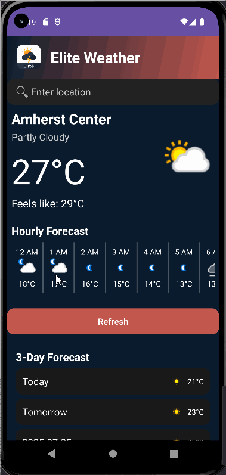

<!-- (This is a comment) INSTRUCTIONS: Go through this page and fill out any **bolded** entries with their correct values.-->

# AND101 Project 6 - Recycler View

Submitted by: **Sheng-Kai Wen**

Time spent: **16** hours spent in total

## Summary

**Elite Weather App** is an android app that **provides real-time weather updates, a 3-day forecast, and air quality information (https://www.weatherapi.com/api.aspx) with a modern and intuitive user interface.**

If I had to describe this project in three (3) emojis, they would be: **🌞☔❄️**

<!-- (This is a comment) Please be sure to change the [ ] to [x] for any features you completed.  If a feature is not checked [x], you might miss the points for that item! -->

The following REQUIRED features are completed:

- [x] Make an API call to an API of your choice using AsyncHTTPClient
- [x] Implement a RecyclerView to display a list of entries from the API
- [x] Display at least three (3) pieces of data for each RecyclerView item

The following STRETCH features are implemented:

- [x] Add a UI element for the user to interact with API further
- [x] Show a `Toast` or `Snackbar` when an item is clicked
- [x] Add item dividers with `DividerItemDecoration`

The following EXTRA features are implemented:

- [x] List anything else that you added to improve the app!
- Set the entire body view the RecyclerView vertically to render different sections

## API Choice

My chosen API for this project is **[https://www.weatherapi.com/api.aspx]**.

## Video Demo

Here's a video / GIF that demos all of the app's implemented features:

GIF created with **LICEcap**

<!-- Recommended tools:
- [Kap](https://getkap.co/) for macOS
- [ScreenToGif](https://www.screentogif.com/) for Windows
- [peek](https://github.com/phw/peek) for Linux. -->

## Notes

## License

Copyright **2025** **Sheng-Kai Wen**

Licensed under the Apache License, Version 2.0 (the "License");
you may not use this file except in compliance with the License.
You may obtain a copy of the License at

    http://www.apache.org/licenses/LICENSE-2.0

Unless required by applicable law or agreed to in writing, software
distributed under the License is distributed on an "AS IS" BASIS,
WITHOUT WARRANTIES OR CONDITIONS OF ANY KIND, either express or implied.
See the License for the specific language governing permissions and
limitations under the License.
